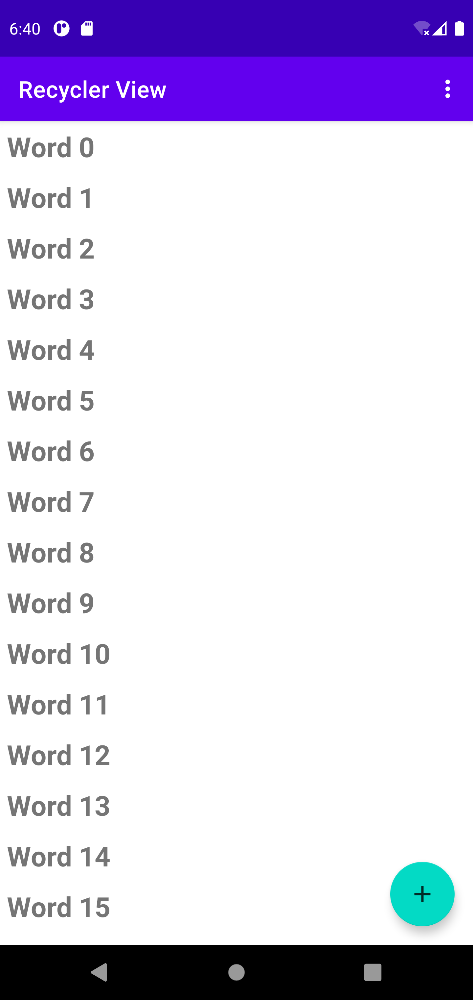
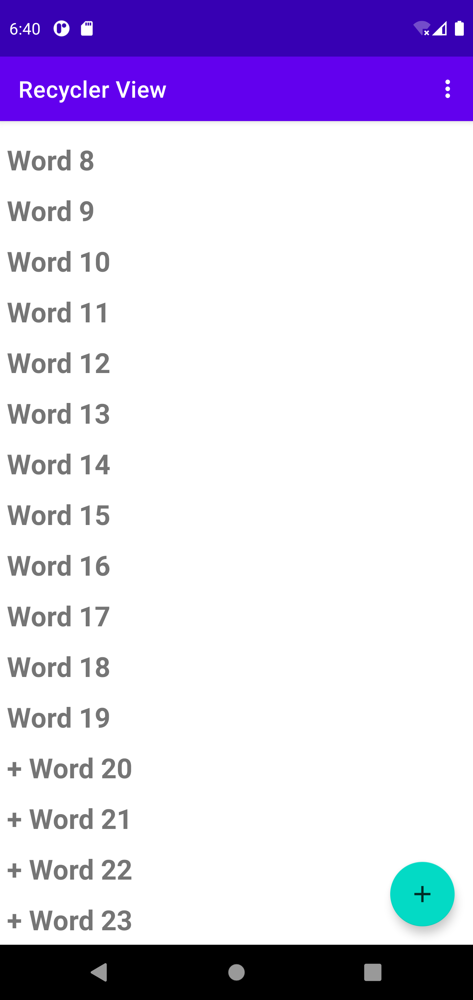
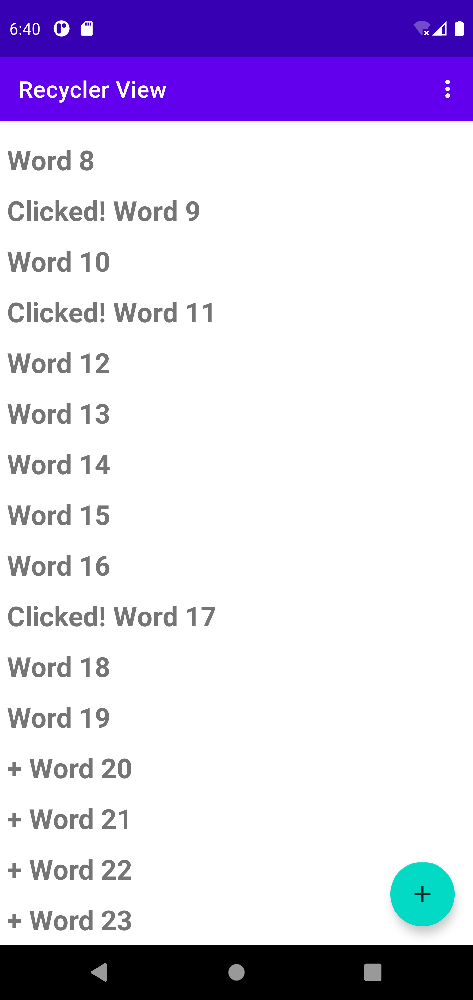
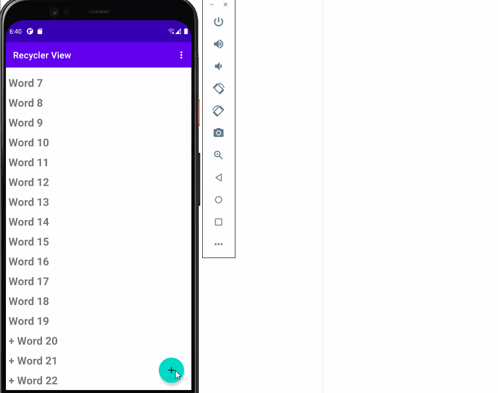
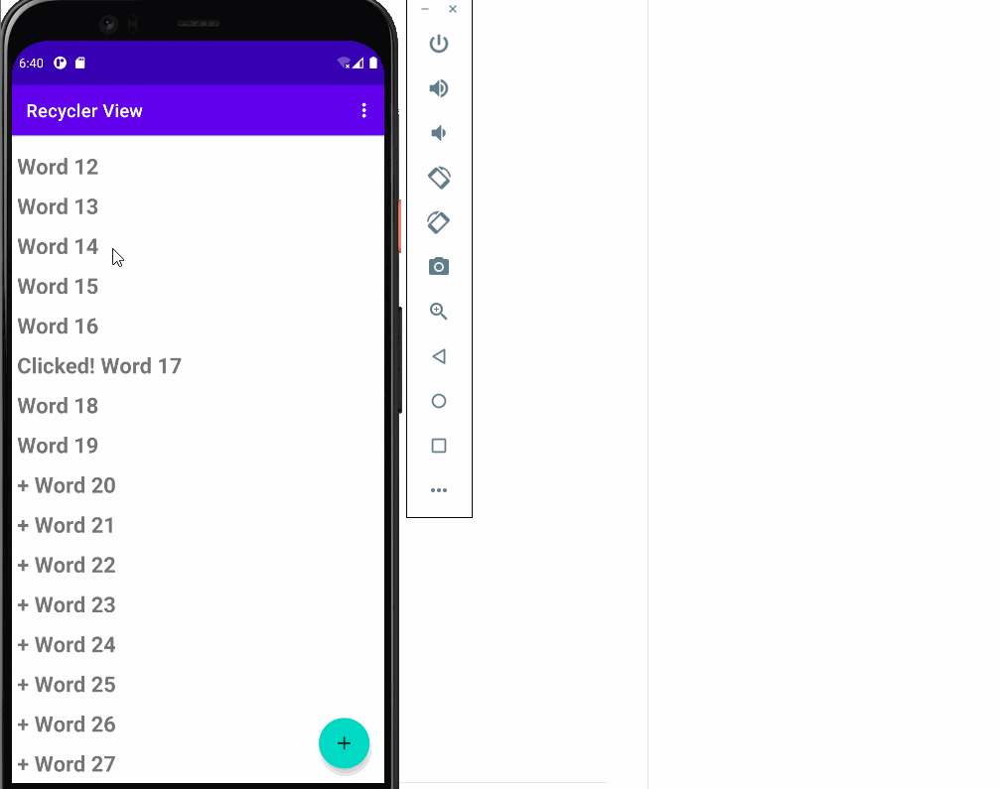
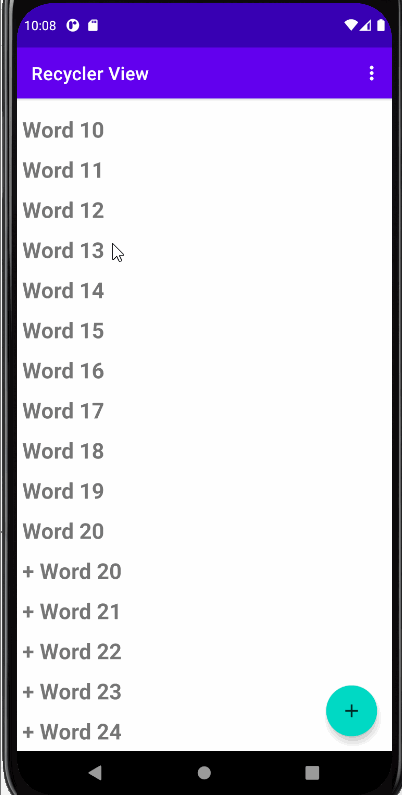
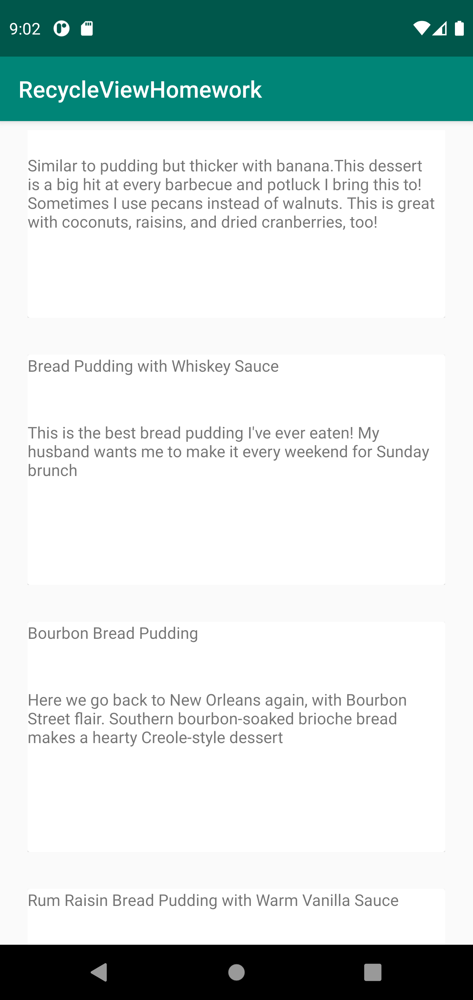
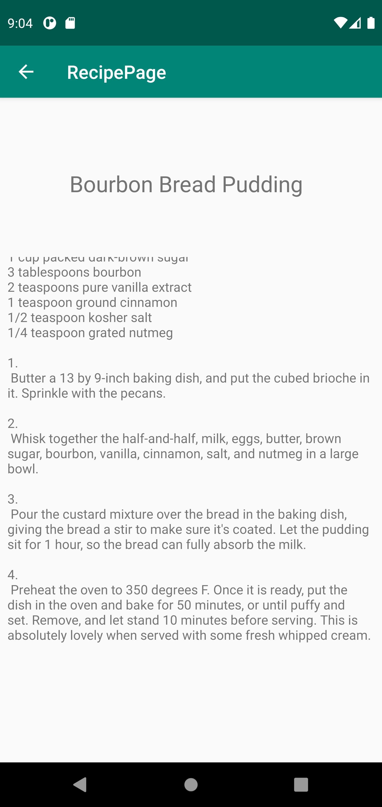
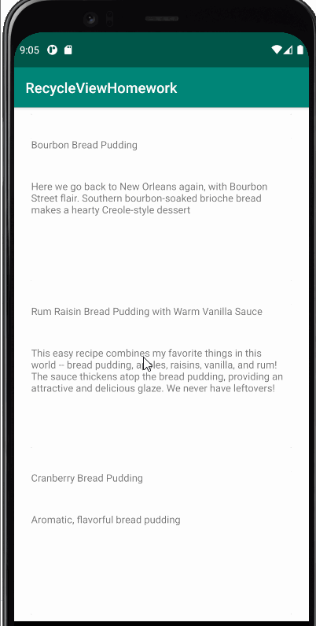

# Lab-6-RecycleView

## lab6 Application Overview

- Application Index

- Add icon clicked

- Items clicked

## lab6 Application Workings

  - Add Button working

  - when items are clicked

# lab6 Challenge

## lab6 Challenge Overview with reset button working

- Application Index

# lab6 Homework

## lab6 homework Application Overview

- Application List Index

- Application Detail-Ingrediants Index

## lab6 Homework Application Workings

  - Item Clicked will redirect to Detail-Ingredients Page

  
